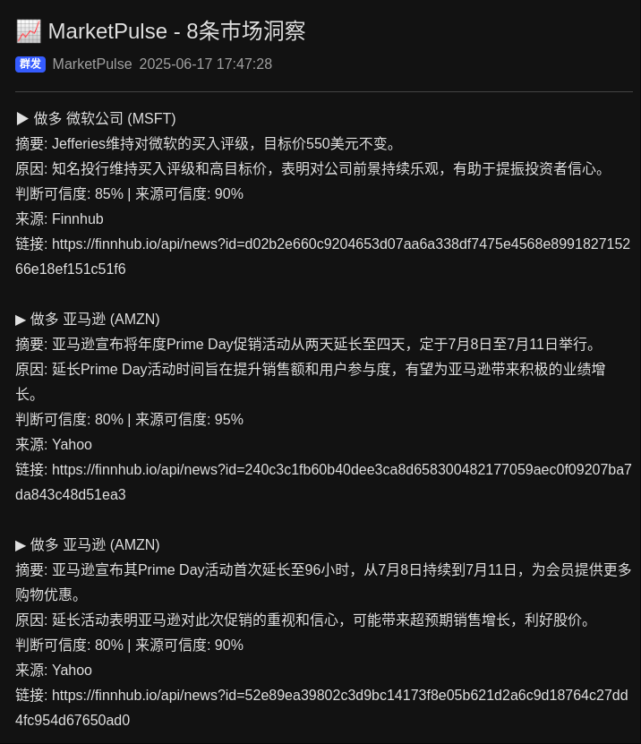

# MarketPulse - 金融资讯 AI 分析推送服务

<div align="center">

[English Version](README_EN.md)

[](https://www.python.org/downloads/)
[](https://opensource.org/licenses/MIT)
[](http://makeapullrequest.com)

</div>

> 本项目完全开源，欢迎社区贡献和改进。如果您觉得这个项目对您有帮助，欢迎给个 star ⭐️

## 贡献指南

我们欢迎任何形式的贡献，包括但不限于：
- 提交问题和建议
- 改进文档
- 提交代码改进
- 分享使用经验

MarketPulse 是一个轻量级的金融资讯分析推送服务，它基于 Google Gemini AI 构建，能够自动获取最新的金融新闻，进行智能分析，并将包含明确**投资建议**、**信心指数**和**来源可靠度**的分析结果，通过 **Bark** 和 **PushPlus** 推送到您的设备。

## 核心特性

- 🤖 基于 [Google Gemini AI](https://github.com/google/generative-ai-python) 的智能分析
- 🔔 通过 [Bark](https://github.com/Finb/Bark) 和 [PushPlus](https://www.pushplus.plus/) 实现多设备实时推送
- 📰 通过 [Finnhub](https://finnhub.io/) 获取最新金融新闻
- 📊 提供市场影响、投资建议、信心指数和来源可靠度（百分比形式）
- ⚙️ 支持多渠道、多设备推送，并为不同渠道优化消息格式
- 🔄 自动去重，避免重复推送
- 🛡️ 安全的环境变量配置
- 🎛️ 守护进程管理 (启动 / 停止 / 重启 / 状态)
- 🧠 状态管理机制，可自动处理 API 推送频率限制

## 系统要求

- Python 3.8+
- uv（推荐用于 Python 环境管理）

## 快速开始

### 1. 安装 uv（可选但推荐）

```bash
curl -LsSf https://astral.sh/uv/install.sh | sh
```

### 2. 克隆项目

```bash
git clone https://github.com/T1mn/MarketPulse.git
cd MarketPulse
```

### 3. 创建虚拟环境并安装依赖

```bash
uv venv
source .venv/bin/activate  # Linux/macOS
# 或
.venv\Scripts\activate  # Windows

uv pip install -r requirements.txt

uv pip install -e .
```

### 4. 配置环境变量

复制 `.env.example` 文件并重命名为 `.env`：

```bash
cp .env.example .env
```

编辑 `.env` 文件，填入您的 API 密钥：

```env
# API Keys
FINNHUB_API_KEY=your_finnhub_api_key
GEMINI_API_KEY=your_gemini_api_key

# Bark Keys (至少填一个)
BARK_KEY_1=your_first_bark_key
# BARK_KEY_2=your_second_bark_key

# PushPlus Token (可选)
PUSHPLUS_TOKEN=your_pushplus_token
# PushPlus 推送群组 (可选, 留空则推送到个人)
PUSHPLUS_TOPIC=your_topic_code
```

### 5. 运行服务

```bash
# 前台直接运行 (用于调试)
python -m MarketPulse.main

# 或通过守护进程在后台运行 (推荐)
python -m MarketPulse.daemon_manager start
```

## 配置说明

### 新闻源配置

在 `config.py` 中可以配置信任的新闻源：

```python
TRUSTED_SOURCES = [
    "Reuters",
    "Bloomberg",
    "The Wall Street Journal",
    "Associated Press",
    "CNBC",
    "Dow Jones Newswires",
    "MarketWatch"
]
```

### 市场关注配置

可以配置关注的股票代码：

```python
US_MARKET_SYMBOLS = [
    "SPY",    # 标普500 ETF
    "DIA",    # 道琼斯指数 ETF
    "QQQ",    # 纳斯达克100 ETF
    "AAPL",   # 苹果
    "MSFT",   # 微软
    "GOOGL",  # 谷歌
    "AMZN",   # 亚马逊
    "TSLA"    # 特斯拉
]
```

### 推送间隔配置

默认每 30 分钟检查一次新闻，可以在 `config.py` 中修改：

```python
NEWS_FETCH_INTERVAL = 30  # 分钟
```

## 推送效果

<details>
<summary>点击查看 Bark 和 PushPlus 推送效果图</summary>

#### PushPlus 微信推送效果



#### Bark 推送效果

由于 Markdown 不支持视频嵌入，请[点击此处查看 Bark 推送录屏](img/bark.mp4)。

</details>

## 注意事项

1.  **API 密钥**: 确保所有需要的 API 密钥都已正确配置。
2.  **环境管理**: 建议使用 uv 进行环境管理，以获得更好的依赖解析性能。
3.  **首次运行**: 首次运行时会立即执行一次任务，之后按 `config.py` 中配置的间隔时间运行。
4.  **状态文件**: 已处理的新闻 ID 和推送服务状态（如推送限制）会保存在 `app_state.json` 中，避免重复推送和超出 API 限制。

## 依赖说明

主要依赖包括：
- `google-generativeai`: [Google Gemini AI](https://github.com/google/generative-ai-python) 接口
- `python-dotenv`: 环境变量管理
- `schedule`: 定时任务调度
- `requests`: HTTP 请求

## 致谢

- [Google Gemini AI](https://github.com/google/generative-ai-python) - 提供强大的 AI 分析能力
- [Bark](https://github.com/Finb/Bark) - 提供便捷的推送服务
- [Finnhub](https://finnhub.io/) - 提供优质的金融新闻数据 API


## 许可证

MIT License 

[](https://www.star-history.com/#T1mn/MarketPulse&Date)

## 服务管理

### 守护进程运行

MarketPulse 支持以守护进程方式运行，提供完整的进程管理功能：

```bash
# 启动服务
python -m MarketPulse.daemon_manager start

# 停止服务
python -m MarketPulse.daemon_manager stop

# 重启服务
python -m MarketPulse.daemon_manager restart

# 查看服务状态
python -m MarketPulse.daemon_manager status
```

服务将完全在后台运行，不会占用终端。启动服务后，您可以安全地关闭终端窗口。

### 日志系统

服务使用分层日志系统，所有日志文件存放在 `logs` 目录下：

- `logs/market_pulse.log`: 主程序运行日志
- `logs/daemon.log`: 守护进程相关日志

查看实时日志：
```bash
# 查看主程序日志
tail -f logs/market_pulse.log

# 查看守护进程日志
tail -f logs/daemon.log
```

日志文件自动轮转：
- 主日志：每个文件最大 10MB，保留 5 个备份文件
- 守护进程日志：每个文件最大 5MB，保留 3 个备份文件

### 进程管理

服务在 `market_pulse.pid` 文件中维护进程 ID，用于进程管理。您不需要直接操作此文件，守护进程管理器会自动处理。

主要特性：
- 完全脱离终端运行
- 自动进程管理
- 优雅的启动和关闭
- 信号处理（SIGTERM, SIGINT）
